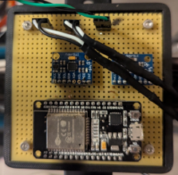

# Hardware Implementation — Balance

## Overview

The balance system is built around a compact, modular board mounted on the bicycle frame. It houses the ESP32 microcontroller, two IMUs, and the signal/power headers for the ESCs and motors.
The board can be physically removed as a unit. As long as the wiring harness is connected correctly, no changes to the board itself should be necessary.

---

## Bill of Materials

Components mounted on the bicycle:

| Component | Link | Qty | Unit price | Total |
|---|---|---|---|---|
| Motor — EMAX Pro Series 2814 | [droneshop.nl](https://droneshop.nl/emax-pro-series-2814-motor) | 2 | €35,95 | €71,90 |
| Propellor — Gemfan 1050 3-blade | [droneshop.nl](https://droneshop.nl/gemfan-1050-3-blade-glass-fiber-nylon-propellers) | 3 | €9,95 | €29,85 |
| ESC — Sequre 28120 120A AM32 | [droneshop.nl](https://droneshop.nl/sequre-28120-120a-esc-am32) | 2 | €59,95 | €119,90 |
| LiPo — Dogcom 21700 20000mAh 6S4P | [droneshop.nl](https://droneshop.nl/dogcom-21700-20000mah-6s4p-22-2v-lion-xt90) | 1 | €149,00 | €149,00 |
| **Total** | | | | **€370,65** |

## Perfboard Layout

The board is a perfboard with the following components mounted on pin headers (making them swappable if needed):

| Component | Role |
|---|---|
| ESP32 (38-pin) | Main microcontroller |
| IMU 1 (primary) | Active IMU used for balance control |
| IMU 2 (secondary) | Mounted and wired, currently unused in software |
| Male pin headers | Connections for ESC signal lines, GND, and power |

---

## Power

| Wire | Voltage | Source |
|---|---|---|
| Green + Black (right side) | 7.5 V | LiPo → Buck converter → ESP32 board |

The black wire is always GND. The green wire carries the 7.5 V supply. This voltage is regulated down on the ESP32 board to 3.3 V for the logic and IMUs.

---

## IMUs

Both IMUs are connected to the ESP32 over the same I²C bus. To avoid address conflicts, the AD0 pin of each IMU is wired differently:

| IMU | AD0 pin | I²C address |
|---|---|---|
| IMU 1 (primary) | GND | `0x68` |
| IMU 2 (secondary) | VCC (3.3 V) | `0x69` |

**Currently, only IMU 1 (`0x68`) is used** in the balance controller. IMU 2 is wired and addressable but not yet integrated in the software. See [What's missing](index.md#whats-missing) for potential use cases (e.g. sensor fusion, redundancy).

---

## ESC Signal Wiring

Motor signals are sent from the ESP32 to the ESCs using **DSHOT** (digital protocol, no calibration needed, no analog noise (see DSHOT library) ).

| GPIO | Signal | ESC / Motor |
|---|---|---|
| GPIO 18 | DSHOT | ESC 1 |
| GPIO 19 | DSHOT | ESC 2 |

Each signal wire is paired with a GND wire (black). These are connected via the male pin headers on the board.

---

## I²C Bus

| Signal | GPIO |
|---|---|
| SDA | GPIO 21 (ESP32 default) |
| SCL | GPIO 22 (ESP32 default) |

Both IMUs share these two lines.

---

## Notes for future teams

- The board is modular, it can be removed or moved.
- IMU 2 is already wired and has a unique I²C address. Adding it to the software only requires initializing it at `0x69`.
