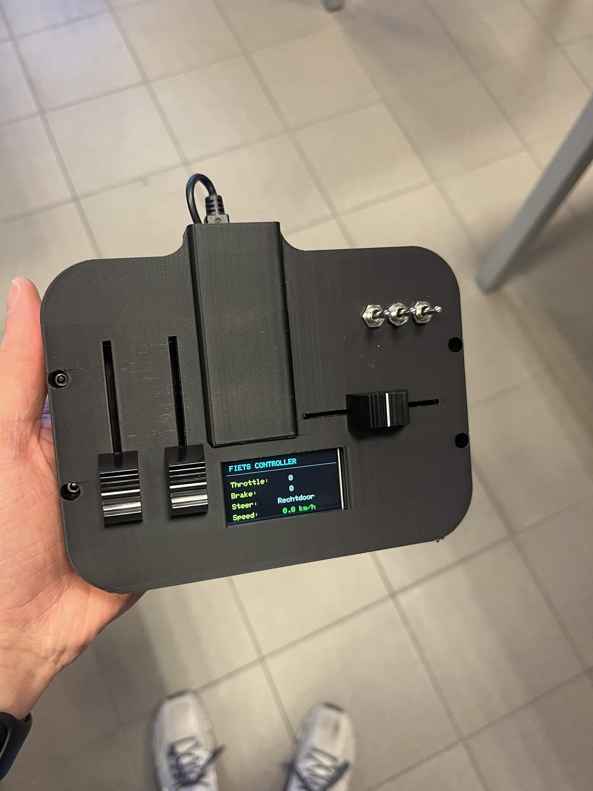
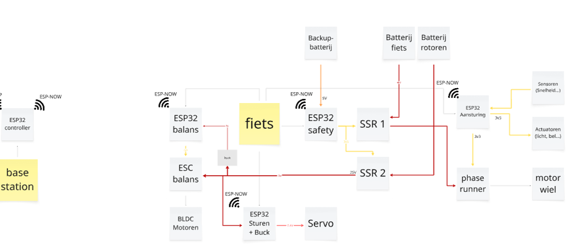

# Remote Controller System — IB3 Self-Driving Bicycle 2025–2026

## Remote Controller Design

To remotely control the bicycle, a custom remote controller was developed.

A stripboard PCB was used because the design mainly consists of separate modules connected through sockets.  
As a result, designing a custom PCB was not necessary.

The remote controller contains:

- 3 sliders
- 3 toggle switches
- TFT display
- ESP32

The remote communicates with all ESP32 modules in the system using **ESP-NOW**.

 <sub> *Figure 1: Controller* </sub>


---

# Slider Controls

## Throttle and Brake

The two vertical sliders on the left side are used for:

- Throttle
- Brake

### Throttle Slider

The leftmost slider controls the throttle.

- `D32` → Throttle slider

The slider must be moved beyond approximately half its range before the bicycle starts moving.

> Be careful when operating the bicycle for the first time.

---

### Brake Slider

The second vertical slider controls the brake.

- `D33` → Brake slider

---

## Steering Slider

The horizontal slider on the right side controls the steering of the bicycle.

- `D34` → Steering slider

---

# Toggle Switches

Three toggle switches are available on the remote controller:

| Position | Function | ESP32 Pin |
|---|---|---|
| Left | Buzzer | `D14` |
| Middle | Balance system enable | `D12` |
| Right | Emergency stop | `D13` |

The emergency stop is currently **not implemented**, because the relay did not function reliably.

---

# TFT Display

To visualize the most important system feedback, a TFT display was added.

The display:
- operates at **3.3V**
- communicates via **SPI**
- contains **11 connection pins**

---

## TFT Display Connections

| TFT Pin | Connection |
|---|---|
| Lite | NC |
| SDCS | NC |
| DC | `D2` |
| RST | `D4` |
| TCS | `D5` |
| MOSI | `D23` |
| MISO | NC |
| SCK | `D18` |
| GND | Common ground |
| 3V | 3.3V pin of ESP32 |
| Vin | NC |

---

# Information Displayed on the Screen

The TFT display continuously shows the following information:

- Throttle value
- Brake value
- Steering direction
- Balance system status

---

## Throttle and Brake Feedback

The throttle and brake values shown on the display are the analog values read from the sliders.

---

## Steering Feedback

For steering, the display shows one of the following states:

- Left
- Right
- Straight

---

## Balance System Feedback

The display also indicates whether the balance system is:

- ON
- OFF

---

# Emergency Stop Screen

When the emergency stop switch is activated, a separate warning screen appears indicating that the emergency stop has been triggered.

While this screen is active:
- no controls on the remote can be used until the emergency stop is disabled again.

This functionality is currently only implemented on the remote controller side and not yet on the bicycle itself.


# Total communication diagram of the bicycle
This is a complete diagram of how the bike communicates and is built, it shows voltage lines, communication between the controller and the different PCB's of our system. 

 <sub> *Figure 2: Block diagram of bicycle communication* </sub> 

# Communication Architecture — ESP-NOW Bike Controller
 
## Table of Contents
1. [System Overview](#system-overview)
2. [Network Topology](#network-topology)
3. [Shared Message Structure](#shared-message-structure)
4. [File Summaries](#file-summaries)
5. [Controller.cpp — Deep Dive](#controllercpp--deep-dive)
6. [IO.cpp — Deep Dive](#iocpp--deep-dive)
7. [Safety.cpp — Deep Dive](#safetycpp--deep-dive)
8. [Servo.cpp — Deep Dive](#servocpp--deep-dive)
---
 
## System Overview
 
This project controls an autonomous/remote-controlled bicycle using four ESP32 microcontrollers that communicate wirelessly via **ESP-NOW**. ESP-NOW operates at the Wi-Fi MAC layer, meaning no router or access point is required. Each device is identified solely by its MAC address.
 
The system follows a **hub-and-spoke model**:
 
- The **Controller** (`Controller.cpp`) is the central hub. It reads all physical inputs (throttle, brake, steering joystick, buzzer button, emergency stop, balance toggle) and periodically broadcasts this data to all other nodes via heartbeat messages.
- The **IO ESP** (`IO.cpp`) receives throttle and brake commands and translates them to analog voltages via DAC outputs. It also reads the wheel speed sensor (Hall effect) and reports speed back to the Controller. It drives the buzzer, front light, and brake light. (Hall sensor needs to be further checked on, this wasn't fully implemented).
- The **Safety ESP** (`Safety.cpp`) monitors the heartbeat from the Controller and controls a Solid State Relay (SSR) that cuts power to the system. It triggers a full hardware failsafe on emergency stop or connection loss. (Because a malfunction in the SSR, this part of the code was ignored in the final presentation. The safetyPCB, wasn't added and therefor the communication would get stuck, trying to send info to this false address.)
- The **Servo ESP** (`Servo.cpp`) receives steering data and positions a servo motor accordingly to physically steer the bicycle.
---
 
## Network Topology
 
```
                        ┌─────────────┐
                        │  CONTROLLER │
                        │  (Hub)      │
                        └──────┬──────┘
               ┌───────────────┼───────────────┐
               ▼               ▼               ▼
        ┌─────────┐     ┌───────────┐    ┌──────────┐
        │  IO ESP │     │ SERVO ESP │    │SAFETY ESP│
        └────┬────┘     └───────────┘    └──────────┘
             │
             ▼ (speed feedback)
        ┌────────────┐
        │ CONTROLLER │
        └────────────┘
```
 
| Node | Role | Sends to | Receives from |
|---|---|---|---|
| Controller | Central hub, input reader | IO, Servo, Safety, Balans | IO (speed) |
| IO ESP | Actuator + speed sensor | Controller (speed data) | Controller |
| Safety ESP | Power relay watchdog | — | Controller |
| Servo ESP | Steering actuator | — | Controller |
 
> **Note:** A fourth "Balans" (balance) node is referenced in `Controller.cpp` but its implementation is not included in this repository. For information about that code, check out [Balance](balance/index.md)
 
---
 
## Shared Message Structure
 
All four nodes use the same `struct_message` to pass data over ESP-NOW. Every packet sent or received must be of this type. This struct isn't optimised at all. This could all be comprimised into 3 parts: 'Sender, Command and Value'. Where for example Command could be 'Throttle' and value would be the Raw ADC. Because of time we didn't optimise the code. Therefore you will find parts that could be more efficient.
 
```cpp
typedef struct struct_message {
  uint8_t sender;    // Identifies the sending node (0 = Controller, 2 = IO, 3 = Servo, ...)
  uint8_t command;   // Command type (see Commands enum below)
  int     throttle;  // Raw ADC value (0–4095) from throttle input
  int     brake;     // Raw ADC value (0–4095) from brake input
  int     sturen;    // Raw ADC value (0–4095) from steering joystick
  float   value;     // Generic float (used for speed data)
  bool    buzzer;    // Buzzer state (true = on)
  bool    balansAan; // Balance mode toggle
} struct_message;
```
 
> ⚠️ `Servo.cpp` uses a slightly shorter version of this struct (without `buzzer` and `balansAan`). Take care when comparing struct sizes across nodes.
 
### Command Codes
 
| Constant | Value | Description |
|---|---|---|
| `CMD_OK` | `0x01` | Heartbeat / normal data packet |
| `CMD_STOP` | `0x02` | Emergency stop — triggers failsafe on all nodes |
| `CMD_BALANS` | `0x03` | Toggle balance mode (sent to Balans ESP only) |
| `CMD_BUZZ` | `0x05` | Buzzer activation (embedded in CMD_OK via the `buzzer` flag, so not used, see the mark I made earlier) |
| `CMD_SPEED_DATA` | `0x0A` | Speed feedback from IO ESP to Controller |
 
---
 
## File Summaries
 
### Controller.cpp
- Reads all physical inputs: throttle, brake, steering, buzzer button, emergency stop button, and balance toggle.
- Sends a heartbeat (`CMD_OK`) every 200 ms to the IO, Servo, and Balans nodes with all current sensor values.
- Detects the emergency stop button and immediately fires a `CMD_STOP` to the Safety ESP.
- Drives a TFT display (ST7789) to show live sensor values and an emergency stop overlay.
### IO.cpp
- Receives throttle and brake values from the Controller and writes them to the bicycle's motor controller via **DAC outputs** (0–3.3V analog).
- Implements a **hold-time failsafe**: if both throttle and brake drop to zero briefly, the last valid values are held for up to 200 ms to avoid glitches.
- Reads a **Hall effect sensor** on the wheel, counts pulses over 500 ms windows, and reports speed back to the Controller.
- Controls the **buzzer**, **front light**, and **brake light** based on incoming commands.
### Safety.cpp
- Acts as a hardware watchdog: it controls a **Solid State Relay (SSR)** that can cut all power to the system.
- Turns the SSR on when `CMD_OK` heartbeats arrive from the Controller, and turns it off and **locks the system** when `CMD_STOP` is received or the connection times out. (That last part happens when `CMD_OK` isn't recevied for (in this case 4000ms), can be changed easily.
- After entering failsafe, the system can only recover via a **physical button press** followed by a full `ESP.restart()`. By using this restart function, we are sure all the memory is resetted and we can use the safety again. Also by adding a physical button, the user is obliged to go to the bike and reset it all. This reset button only works if the controller STOP button is already deactivated agian.
- The timeout-based failsafe (`okTimeout`) is present in the code but currently commented out.
### Servo.cpp
- Receives steering joystick values from the Controller and maps them to servo angles (60°–120°, centered at 90°).
- Applies a **dead zone** around the joystick center (±~40 ADC counts around 1960) to prevent drift.
- Returns the servo to center (90°) on `CMD_STOP` or when the joystick is in the dead zone.
- All logic is event-driven through the ESP-NOW receive callback; the `loop()` function is empty.
---
 
## Controller.cpp — Deep Dive
 
### Pin Definitions and MAC Addresses
 
```cpp
const uint8_t PIN_NOODKNOP    = 13;  // Emergency stop button
const uint8_t PIN_BUZZ_BUTTON = 14;  // Buzzer button
const int PIN_STUUR           = 34;  // Steering joystick (ADC)
const int PIN_THROTTLE        = 32;  // Throttle (ADC)
const int PIN_BRAKE           = 33;  // Brake (ADC)
const int PIN_BALANS_AAN      = 12;  // Balance mode toggle switch
```
 
Each peer node is identified by its hardcoded MAC address. These must match the actual MAC printed at boot by each ESP32 (`WiFi.macAddress()`).
 
---
 
### TFT Display Initialization
 
```cpp
tft.init(170, 320);
tft.setRotation(1);
tft.fillScreen(ST77XX_BLACK);
```
 
The ST7789 display is initialized at 170×320 pixels in landscape mode. Static labels (Throttle, Brake, Steer, Balans) are drawn once in `setup()` to avoid unnecessary full redraws. Only the value fields are updated each loop iteration using `ST77XX_BLACK` as background color to overwrite previous values without flickering.
 
---
 
### ESP-NOW Peer Registration
 
```cpp
auto addPeer = [](uint8_t* addr) {
  esp_now_peer_info_t peerInfo = {};
  memcpy(peerInfo.peer_addr, addr, 6);
  esp_now_add_peer(&peerInfo);
};
addPeer(ioAddress); addPeer(servoAddress); addPeer(balansAddress);
```
 
A lambda function is used to keep peer registration DRY. Note that `safetyAddress` is **not** added as a regular peer here — the Controller only sends to it during an emergency stop, and that send goes out before a regular peer check in some ESP-NOW implementations. Consider adding Safety as a peer in `setup()` for robustness.
 
---
 
### Heartbeat Loop
 
```cpp
if (millis() - lastHeartbeat > heartbeatInterval) {
  msg.sender   = 0;
  msg.command  = CMD_OK;
  msg.throttle = valThrottle;
  msg.brake    = valBrake;
  msg.sturen   = valStuur;
  msg.buzzer   = isBuzzing;
  msg.balansAan = balansAan;
  esp_now_send(ioAddress,    (uint8_t*)&msg, sizeof(msg));
  esp_now_send(servoAddress, (uint8_t*)&msg, sizeof(msg));
  esp_now_send(balansAddress,(uint8_t*)&msg, sizeof(msg));
  lastHeartbeat = millis();
}
```
 
Every 200 ms, the Controller packages all sensor readings into a single `struct_message` and sends it to IO, Servo, and Balans. This same packet carries the buzzer flag — there is no separate buzzer command. The Safety node does **not** receive the heartbeat (the corresponding `esp_now_send` line is commented out), so the timeout-based failsafe in `Safety.cpp` is effectively disabled. Again this needs to be looked at.
 
---
 
### Emergency Stop
 
```cpp
if (digitalRead(PIN_NOODKNOP) == HIGH) {
  msg.command = CMD_STOP;
  esp_now_send(safetyAddress, (uint8_t*)&msg, sizeof(msg));
}
```
 
The emergency stop is **polled every loop iteration** (not debounced). When detected, `CMD_STOP` is sent to the Safety ESP, which then cuts the SSR. The display simultaneously switches to a full-screen red "IN NOODSTOP" overlay and blocks in a `while` loop until the button is released, after which `setup()` is called again to restore the UI.
 
---
 
### Balance Mode Change Detection
 
```cpp
if (balansAan != vorigeBalansAan) {
  msg.command = CMD_BALANS;
  esp_now_send(balansAddress, (uint8_t*)&msg, sizeof(msg));
  vorigeBalansAan = balansAan;
}
```
 
`CMD_BALANS` is only transmitted on a **state change** of the toggle switch, not continuously. This prevents the Balans ESP from receiving redundant toggle events every heartbeat cycle.
 
---
 
## IO.cpp — Deep Dive
 
### Hall Effect Speed Sensor
 
```cpp
void IRAM_ATTR hallISR() {
  pulseCount++;
}
attachInterrupt(digitalPinToInterrupt(PIN_HALL), hallISR, RISING);
```
 
The Hall sensor ISR is placed in IRAM (`IRAM_ATTR`) to ensure it executes even during flash cache misses. Pulse counting happens in the background; every 500 ms the main loop atomically reads and resets the counter using an interrupt-safe critical section (`noInterrupts()`/`interrupts()`).
 
---
 
### Speed Calculation and Reporting
 
```cpp
float speed = pulses * 0.5;
msg.sender  = IO_ESP;
msg.command = CMD_SPEED_DATA;
msg.value   = speed;
esp_now_send(controllerAddress, (uint8_t*)&msg, sizeof(msg));
```
 
Speed is expressed in pulses per second (scaled by 0.5 since the window is 500 ms). To convert to an actual wheel speed, a calibration factor based on wheel circumference and magnet count would need to be applied.
 
---
 
### DAC Output and Failsafe Hold
 
```cpp
float throttleEff = (incomingMsg.throttle / 4095.0) * maxVoltage;
float brakeEff    = (incomingMsg.brake    / 4095.0) * maxVoltage;
 
if (throttleEff != 0 || brakeEff != 0) {
  lastValidTime = millis();
} else {
  if (millis() - lastValidTime < holdTime) {
    throttleEff = lastThrottle;
    brakeEff    = lastBrake;
  }
}
 
dacWrite(PIN_THROTTLE, (throttleEff / maxVoltage) * 255);
dacWrite(PIN_BRAKE,    (brakeEff    / maxVoltage) * 255);
```
 
Incoming 12-bit ADC values (0–4095) are linearly mapped to 0–3.3V, then scaled to 8-bit DAC values (0–255) for output. The **hold-time** mechanism prevents the motor controller from seeing a sudden zero when a single packet is dropped — it holds the last known non-zero value for up to 200 ms.
 
---
 
### Brake Light Logic
 
```cpp
digitalWrite(PIN_BRAKELIGHT, brakeEff >= 1.5 ? HIGH : LOW);
```
 
The brake light activates when brake voltage exceeds 1.5V (roughly 45% of full brake input), providing a simple threshold-based brake light trigger.
 
---
 
## Safety.cpp — Deep Dive
 
### SSR Control and Failsafe Lock
 
```cpp
bool isFailsafe = false;
 
void OnDataRecv(...) {
  if (incoming.command == 0x01) { // CMD_OK
    lastOkTime = millis();
    if (!isFailsafe) {
      digitalWrite(PIN_SSR_MAIN, HIGH);
    }
  } else if (incoming.command == 0x02) { // CMD_STOP
    enterFailsafe("Handmatige noodstop via controller");
  }
}
```
 
The `isFailsafe` flag acts as a **software latch**: once set, the SSR cannot be turned on again by any incoming message. The only way to clear it is a full hardware restart via `ESP.restart()`. This prevents a buggy or compromised Controller from re-enabling power after a stop.
 
---
 
### Failsafe Recovery Sequence
 
```cpp
void enterFailsafe(String reden) {
  digitalWrite(PIN_SSR_MAIN, LOW);
  isFailsafe = true;
 
  while (digitalRead(PIN_RESET_BTN) == HIGH) { delay(50); }
  delay(50);
  while (digitalRead(PIN_RESET_BTN) == LOW)  { delay(50); }
  delay(200);
 
  ESP.restart();
}
```
 
The recovery sequence requires a deliberate **press-and-release** of the physical button (debounced with delays). The ESP then restarts cleanly, reinitializing all state. This prevents accidental recovery from a brief mechanical vibration or glitch.
 
---
 
### Heartbeat Timeout (Currently Disabled)
 
```cpp
// if (millis() - lastOkTime > okTimeout) {
//   enterFailsafe("Verbinding met controller verloren (timeout)");
// }
```
 
A 4-second timeout that would trigger a failsafe if the Controller goes silent is present but commented out. When the heartbeat send to Safety is re-enabled in `Controller.cpp`, this block should be uncommented to provide full dead-man's-switch behavior.
 
---
 
## Servo.cpp — Deep Dive
 
### Steering Mapping
 
```cpp
int hoek = map(incomingMsg.sturen, 0, 4095,
               SERVO_MIDDEN - SERVO_MAX,
               SERVO_MIDDEN + SERVO_MAX);
hoek = constrain(hoek, SERVO_MIDDEN - SERVO_MAX, SERVO_MIDDEN + SERVO_MAX);
stuurServo.write(hoek);
```
 
The joystick ADC range (0–4095) is mapped linearly to servo angles (60°–120°). A `constrain()` call ensures the servo never receives an out-of-range command, protecting the physical steering mechanism.
 
---
 
### Dead Zone
 
```cpp
if (incomingMsg.sturen > 1920 && incomingMsg.sturen < 2000) {
  stuurServo.write(SERVO_MIDDEN);
  return;
}
```
 
A narrow dead zone around the joystick center (~ADC 1960) prevents the servo from jittering when the stick is at rest. Values inside this window snap the servo directly to 90° (center). Note that the dead zone boundaries (`1920`–`2000`) are asymmetric relative to the theoretical center of 2047; adjustment may be needed after hardware calibration.
 
---
 
### Event-Driven Architecture
 
```cpp
void loop() {
  // Alles via callback
}
```
 
The Servo ESP has an empty `loop()`. All logic is handled inside `onDataRecv()`, which is called by the ESP-NOW stack whenever a packet arrives. This is valid for low-throughput actuator nodes where there is nothing else to do between packets.
 
---
 
## Known Issues and Recommendations
 
| # | Issue | Recommendation |
|---|---|---|
| 1 | Safety ESP needs to be added, once the working SSRs are there.
| 2 | Heartbeat is not sent to Safety ESP | Uncomment the `esp_now_send(safetyAddress, ...)` line |
| 3 | Timeout failsafe is disabled in Safety | Uncomment the timeout check in `Safety.cpp` `loop()` once heartbeat is restored |
| 4 | `struct_message` differs between Servo and other nodes | Standardize the struct across all nodes to avoid undefined behavior on partial reads |
| 5 | The structs aren't ideal | Expand the commands and try to make the struct smaller |
| 6 | The codes aren't optimal because end of project | Rearange parts of the codes that aren't used and try to keep it simple |
