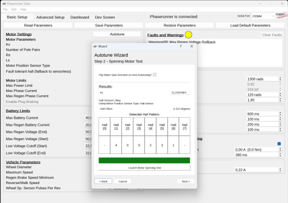
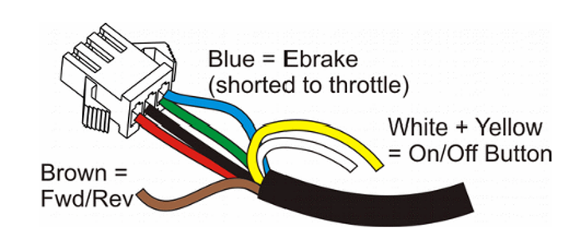
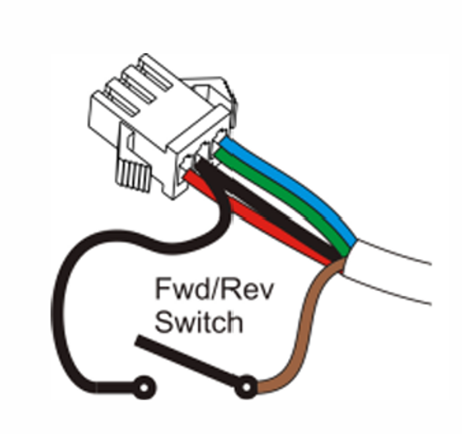
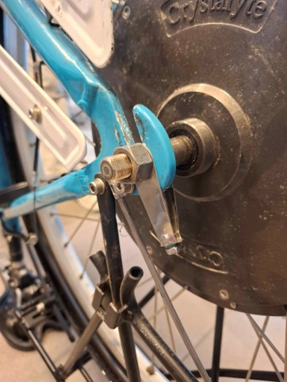

# Drive System — IB3 Self-Driving Bicycle 2025–2026

## Contents

1. [Components](#components)
2. [Control and Software Configuration](#control-and-software-configuration)
3. [Conclusion and Recommendations](#conclusion-and-recommendations)

---

# Components

- **Motor Controller:**  
  The selected controller is the **Phaserunner V2**.  
  This is a compact **Field Oriented Controller (FOC)** known for its high efficiency and silent operation.

- **Drive Unit:**  
  A **3-phase hub motor** mounted directly in the rear wheel.

- **Power Source:**  
  The system is powered by a **48V battery pack**.

---

# Control and Software Configuration

The Phaserunner V2 is configured using the accompanying software: **Phaserunner Suite**.  
This software allows all controller parameters and calibration settings to be configured.

*Figure 1 — Phaserunner Suite: calibration*

---

For the connections between the Phaserunner and the motor, several wires must be connected correctly to guarantee proper operation.

The figure below shows the function of each wire.

- The **green** and **blue** wires are respectively:
  - **Throttle**
  - **E-brake**

Initially these wires were connected together, but for the self-driving bicycle they must be controlled independently.

They are connected to an **ESP32**:
- `D25` → throttle
- `D26` → e-brake

The **white** and **yellow** wires provide power control for the Phaserunner.

These wires should be connected to an **SSR (Solid State Relay)** that acts as a switch controlled by the **Safety PCB**.

Currently, these two wires are directly connected together so the Phaserunner can operate without the Safety PCB.

There is also a **brown wire** used to switch between:
- Forward driving
- Reverse driving

To enable reverse driving, additional hardware is required which has not yet been implemented.

*Figure 2 — Connections*

---

*Figure 3 — Forward / Reverse connection*

---

# PCB and ESP32 Control System

A stripboard PCB was used for controlling the following components:

- Buzzer
- Brake
- Throttle
- Front light
- Rear light
- Hall sensor

These components are controlled by an **ESP32** which communicates with the main controller using **ESP-NOW**.

---

## Power Supply

The ESP32 is powered through a **buck converter** that converts the **22V balance system supply** to **7.4V**.

This 7.4V output is connected to the **VIN pin** of the ESP32.

---

## Hall Sensor

A hall sensor is included in the system to measure the bicycle speed in future implementations.

Although it is not currently used in software, the sensor is already connected to:

- `D14` → Hall sensor

---

## Additional Features

### Buzzer with Integrated LED

A buzzer with an integrated LED is connected to:

- `D27` → Buzzer + LED

---

### Front Light

The front bicycle light is connected to:

- `D32` → Front light

The light automatically turns on when:
- the system power is enabled, and
- a connection with the controller is established.

---

### Rear Light

The rear light is connected to:

- `D33` → Rear light

The rear light turns on whenever the brake is activated from the controller.

---

# Conclusion and Recommendations

For future iterations, it is strongly recommended to use **torque arms** to prevent axle spin.

*Figure 4 — Torque arm*
