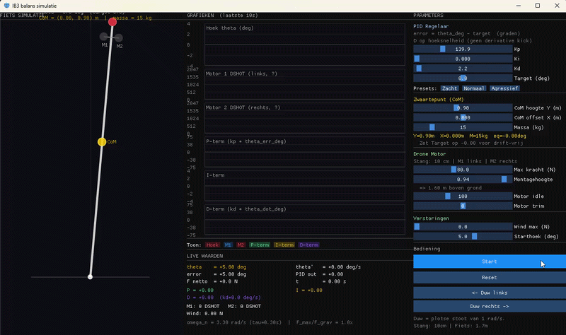

# Inverted Pendulum PID Simulation

Real-time inverted pendulum simulator built with C++, Dear ImGui and DirectX11.

## Features

- Real-time PID controller simulation
- Adjustable physical parameters
- Live visualization of the pendulum system
- Real-time graphs for:
  - P term
  - I term
  - D term
  - Total PID output
  - Pendulum angle
  - Angular velocity

---

# Adjustable Parameters

The simulator allows live modification of:

- Pendulum weight
- Motor thrust / force
- Rod length
- Center of gravity
- Initial angle

---

# PID Controller

Live tuning of:
- `Kp`
- `Ki`
- `Kd`

---

# Technologies

- C++
- Dear ImGui
- DirectX11
- Win32 API
- CMake
- CLion

---

# Real-Time Graphs

The application visualizes:
- Proportional response
- Integral accumulation
- Derivative damping
- System stability
- Oscillation behavior
- Overshoot

---

# Simulation demo
You can see the angle of the pendulum. The output for the two motors. P, I and D values.

